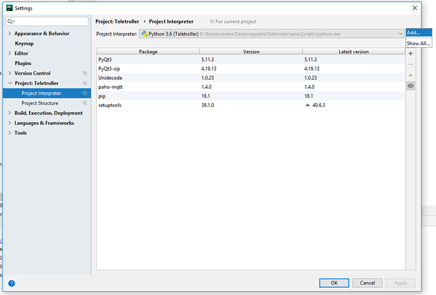
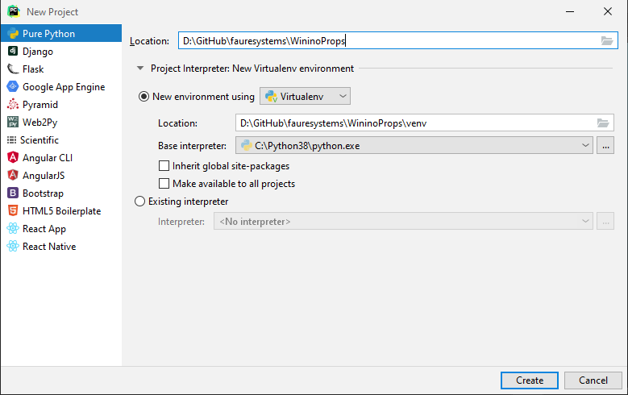

[<- back](README.md)

# Python *venv* (PyCharm)
Create *venv* in a PyCharm project.

You may also consider [Python *venv* (Windows command line)](python-venv-windows.md) which is the recommended method to create *venv* for Room 2.0 plugins.


## Add new *venv* in the project folder
Choose *Add...* in File / Settings / Project: *Project name* / Project Interpreter:



Alternatively the virtual environment can be created during the creation of the project:



### Important
Preferably, do NOT select the following options:
* Inherit global site-packages
* Make available to all projects

## Upgrade PIP
In *Terminal* window run: `python -m pip install -U pip`

It will probably fail, so force install with: `python -m pip install -U --force-reinstall pip`


## Install PyQt5, paho-mqtt and unicode

```bash
(venv) D:\Room\rooms\Demo\Applets\Teletroller>pip install PyQt5
Collecting PyQt5
  Downloading https://files.pythonhosted.org/packages/a7/2d/.../PyQt5-5.11.3-5.11.2-cp35.cp36.cp37.cp38-none-win_amd64.whl (93.4MB)

    100% |████████████████████████████████| 93.4MB 262kB/s
Collecting PyQt5_sip<4.20,>=4.19.11 (from PyQt5)
  Downloading https://files.pythonhosted.org/packages/8d/4d/.../PyQt5_sip-4.19.13-cp36-none-win_amd64.whl (51kB)
    100% |████████████████████████████████| 61kB 10.3MB/s
Installing collected packages: PyQt5-sip, PyQt5
Successfully installed PyQt5-5.11.3 PyQt5-sip-4.19.13

(venv) D:\Room\rooms\Demo\Applets\Teletroller>pip install paho-mqtt
Collecting paho-mqtt
  Downloading https://files.pythonhosted.org/packages/25/63/.../paho-mqtt-1.4.0.tar.gz (88kB)
    100% |████████████████████████████████| 92kB 2.5MB/s
Installing collected packages: paho-mqtt
  Running setup.py install for paho-mqtt ... done
Successfully installed paho-mqtt-1.4.0

(venv) D:\Room\rooms\Demo\Applets\Teletroller>pip install unidecode
Collecting unidecode
  Downloading https://files.pythonhosted.org/packages/31/39/.../Unidecode-1.0.23-py2.py3-none-any.whl (237kB)
    100% |████████████████████████████████| 245kB 5.4MB/s
Installing collected packages: unidecode
Successfully installed unidecode-1.0.23
```


## Project dependencies

From https://pip.pypa.io/en/stable/reference/pip_freeze/


Generate output suitable for a requirements file.
```bash
$ pip freeze
docutils==0.11
Jinja2==2.7.2
MarkupSafe==0.19
Pygments==1.6
Sphinx==1.2.2
```

For Python 3 on Raspberry Pi.
```bash
$ pip3 freeze -l
guizero==1.0.0
mplayer.py==0.7.1
paho-mqtt==1.3.1
pyaml==17.12.1
PyYAML==3.12
SPI-Py==1.0
wiringpi==2.44.4
```

Generate a requirements file and then install from it in another environment.
```bash
$ env1/bin/pip freeze > requirements.txt
$ env2/bin/pip install -r requirements.txt
```


## Author

**Marie FAURE** (Dec 5th, 2019)
* company: FAURE SYSTEMS SAS
* mail: dev at faure dot systems
* github: <a href="https://github.com/fauresystems?tab=repositories" target="_blank">fauresystems</a>
* web: <a href="https://faure.systems/" target="_blank">Faure Systems</a>