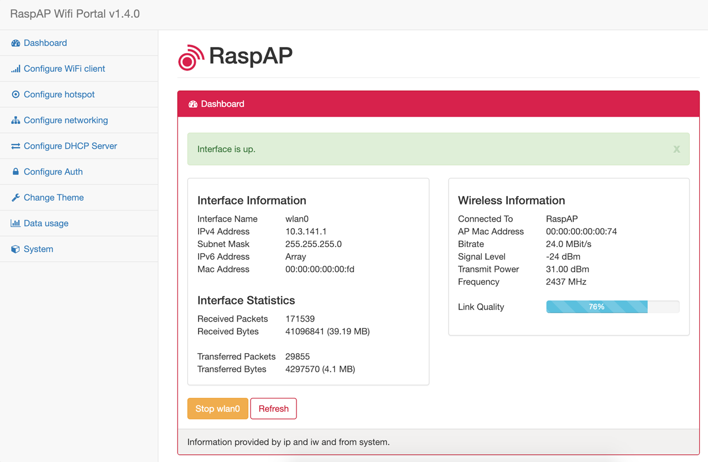
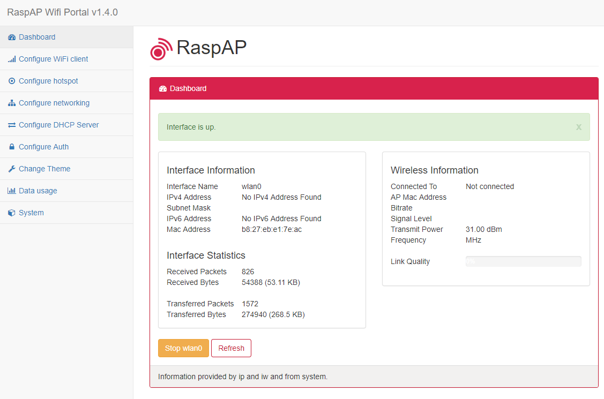

[<- back](README.md)

# Make Raspberry Pi a Wifi Bridge
We can use the Raspberry Pi as a Wifi Access Point to extend a Wifi network and we can setup this AP as a level 2 bridge:
1. RaspAP installation
2. RaspAP web gui
3. Setup as a Level 2 Bridge
4. Credits

## 1. RaspAP installation

The web gui quick installer will install a *lighttpd* server with PHP. We setup our Raspberry Pi as usual with NOOBS then we install RaspAP automatically from: 

```csharp
$ wget -q https://git.io/voEUQ -O /tmp/raspap && bash /tmp/raspap 
```

Respond always *Yes* to the installer: *y* then always *Y*, the last question is to reboot.


```csharp
pi@piwifirepeater:~ $ wget -q https://git.io/voEUQ -O /tmp/raspap && bash /tmp/raspap 


 888888ba                              .d888888   888888ba
 88     8b                            d8     88   88     8b
a88aaaa8P' .d8888b. .d8888b. 88d888b. 88aaaaa88a a88aaaa8P
 88    8b. 88    88 Y8ooooo. 88    88 88     88   88
 88     88 88.  .88       88 88.  .88 88     88   88
 dP     dP  88888P8  88888P  88Y888P  88     88   dP
                             88
                             dP

The Quick Installer will guide you through a few easy steps


RaspAP Install: Configure installation
Detected Raspian 9.0 (Stretch)
Install directory: /etc/raspap
Lighttpd directory: /var/www/html
Complete installation with these values? [y/N]: y
RaspAP Install: Updating sources
Get:1 http://raspbian.raspberrypi.org/raspbian stretch InRelease [15.0 kB]
Hit:2 http://archive.raspberrypi.org/debian stretch InRelease                                             
Get:3 http://raspbian.raspberrypi.org/raspbian stretch/main armhf Packages [11.7 MB]
Get:4 http://raspbian.raspberrypi.org/raspbian stretch/non-free armhf Packages [95.5 kB]                                                                                                                                                     
Fetched 11.8 MB in 14s (831 kB/s)                                                                                                                                                                                                            
Reading package lists... Done
RaspAP Install: Installing required packages
Reading package lists... Done
Building dependency tree       
Reading state information... Done
git is already the newest version (1:2.11.0-3+deb9u4).
The following package was automatically installed and is no longer required:
  realpath
Use 'sudo apt autoremove' to remove it.
The following additional packages will be installed:
  dns-root-data dnsmasq-base libfam0 libnl-route-3-200 php-common php7.0-cli php7.0-common php7.0-json php7.0-opcache php7.0-readline spawn-fcgi
Suggested packages:
  fam rrdtool php5-cgi apache2-utils lighttpd-doc php-pear vnstati
The following NEW packages will be installed:
  dns-root-data dnsmasq dnsmasq-base hostapd libfam0 libnl-route-3-200 lighttpd php-common php7.0-cgi php7.0-cli php7.0-common php7.0-json php7.0-opcache php7.0-readline spawn-fcgi vnstat
0 upgraded, 16 newly installed, 0 to remove and 32 not upgraded.
Need to get 4,010 kB of archives.
After this operation, 17.5 MB of additional disk space will be used.
Do you want to continue? [Y/n]
```

The installer will complete the steps in the manual installation (below) for you.

After the reboot at the end of the installation the wireless network will be configured as an access point as follows:

* IP address: 10.3.141.1
* Username: admin
* Password: secret
* DHCP range: 10.3.141.50 to 10.3.141.255
* SSID: raspi-webgui
* Password: ChangeMe


### Manual installation
Manual installation is possible and maybe interesting reading: https://github.com/billz/raspap-webgui#manual-installation

## 2. RaspAP web gui
You can configure the access point from a browser, on the Pi AP with [http://localhost](http://localhost) or from the main network with the Pi AP IP address, for example http://192.168.1.32



## 3. Setup as a Level 2 Bridge
Arduino and Raspberry props can now reach raspi-webgui wifi network with *ChangeMe* key.

To get full functional props with ICMP (ping) and MQTT, we need to setup a Level 2 Bridge (instead of Level 3 routing and NAT).

### Install *bridge-utils*

```csharp
sudo apt-get install bridge-utils
sudo brctl addbr br0
sudo brctl addif br0 eth0 wlan0

pi@piwifirepeater:~ $ brctl show
bridge name	bridge id		STP enabled	interfaces
br0		8000.b827ebb42bf9	no		eth0
							wlan0
```


### Setup network interfaces in */etc/network/interfaces*

```csharp
pi@piwifirepeater:~ $ cat /etc/network/interfaces
# interfaces(5) file used by ifup(8) and ifdown(8)

# Please note that this file is written to be used with dhcpcd
# For static IP, consult /etc/dhcpcd.conf and 'man dhcpcd.conf'

# -- Bridge --

# do NOT autoconfigure bridge ports/enslaved interfaces!
iface eth1 inet manual
iface eth1 inet6 manual
iface wlan0 inet manual
iface wlan0 inet6 manual

# autoconfigure bridge interface, add bridge ports. Note wlan0 is also added
# to the bridge within /etc/hostapd/hostapd.conf. If not also added here an
# an IPv6 address attaches to the adapter it seems.
auto br0
iface br0 inet manual
  bridge_ports eth0 wlan0


# Include files from /etc/network/interfaces.d:
source-directory /etc/network/interfaces.d
```

### Add bridge *br0* interface in */etc/dhcpcd.conf*

```csharp
pi@piwifirepeater:~ $ cat /etc/dhcpcd.conf 
# Defaults from Raspberry Pi configuration
hostname
clientid
persistent
option rapid_commit
option domain_name_servers, domain_name, domain_search, host_name
option classless_static_routes
option ntp_servers
require dhcp_server_identifier
slaac private
nohook lookup-hostname

# RaspAP-WebGui wireless configuration
#interface wlan0
#static ip_address=10.3.141.1/24
#static routers=10.3.141.1
#static domain_name_server=8.8.8.8

# Bridge setup
denyinterfaces eth0 wlan0
interface br0
static ip_address=192.168.1.200/24
static routers=192.168.1.1
static domain_name_server=192.168.1.1
```

### Add bridge *br0* interface in *hostapd.conf*

```csharp
pi@piwifirepeater:~ $ cat /etc/hostapd/hostapd.conf 
driver=nl80211
ctrl_interface=/var/run/hostapd
ctrl_interface_group=0
beacon_int=100
auth_algs=1
wpa_key_mgmt=WPA-PSK
ssid=raspi-webgui
channel=1
hw_mode=g
wpa_passphrase=ChangeMe
interface=wlan0
wpa=1
wpa_pairwise=TKIP
country_code=
## Rapberry Pi 3 specific to on board WLAN/WiFi
#ieee80211n=1 # 802.11n support (Raspberry Pi 3)
#wmm_enabled=1 # QoS support (Raspberry Pi 3)
#ht_capab=[HT40][SHORT-GI-20][DSSS_CCK-40] # (Raspberry Pi 3)

bridge=br0
```

### DHCP server on the AP is not needed in *dnsmasq.conf*

```csharp
pi@piwifirepeater:~ $ cat /etc/dnsmasq.conf 
domain-needed
interface=wlan0
```

### At the end we have particular *ifconfig*

```csharp
pi@piwifirepeater:~ $ ifconfig 
br0: flags=4163<UP,BROADCAST,RUNNING,MULTICAST>  mtu 1500
        inet 192.168.1.200  netmask 255.255.255.0  broadcast 192.168.1.255
        inet6 fe80::ba27:ebff:feb4:2bf9  prefixlen 64  scopeid 0x20<link>
        inet6 2a01:cb15:811a:800:eca3:e33:fa99:5bfd  prefixlen 64  scopeid 0x0<global>
        ether b8:27:eb:b4:2b:f9  txqueuelen 1000  (Ethernet)
        RX packets 10049  bytes 991979 (968.7 KiB)
        RX errors 0  dropped 240  overruns 0  frame 0
        TX packets 7201  bytes 2819598 (2.6 MiB)
        TX errors 0  dropped 0 overruns 0  carrier 0  collisions 0

eth0: flags=4163<UP,BROADCAST,RUNNING,MULTICAST>  mtu 1500
        ether b8:27:eb:b4:2b:f9  txqueuelen 1000  (Ethernet)
        RX packets 12499  bytes 1467671 (1.3 MiB)
        RX errors 0  dropped 0  overruns 0  frame 0
        TX packets 10725  bytes 3060590 (2.9 MiB)
        TX errors 0  dropped 0 overruns 0  carrier 0  collisions 0

lo: flags=73<UP,LOOPBACK,RUNNING>  mtu 65536
        inet 127.0.0.1  netmask 255.0.0.0
        inet6 ::1  prefixlen 128  scopeid 0x10<host>
        loop  txqueuelen 1000  (Local Loopback)
        RX packets 21  bytes 1448 (1.4 KiB)
        RX errors 0  dropped 0  overruns 0  frame 0
        TX packets 21  bytes 1448 (1.4 KiB)
        TX errors 0  dropped 0 overruns 0  carrier 0  collisions 0

wlan0: flags=4163<UP,BROADCAST,RUNNING,MULTICAST>  mtu 1500
        ether b8:27:eb:e1:7e:ac  txqueuelen 1000  (Ethernet)
        RX packets 2301  bytes 143138 (139.7 KiB)
        RX errors 0  dropped 0  overruns 0  frame 0
        TX packets 4533  bytes 776125 (757.9 KiB)
        TX errors 0  dropped 0 overruns 0  carrier 0  collisions 0
```

### And particular *RaspAP web gui*

RaspAP weg gui in bridge mode:


## 4. Credits

Original wifi AP idea from https://raspbian-france.fr/creer-un-hotspot-wi-fi-en-moins-de-10-minutes-avec-la-raspberry-pi/

RaspAP on GitHub: https://github.com/billz/raspap-webgui

### Raspberry Pi Documentation
This is the official documentation for the Raspberry Pi, written by the Raspberry Pi Foundation with community contributions: https://github.com/raspberrypi/documentation

* Setting up a Raspberry Pi as an access point in a standalone network (NAT): https://github.com/raspberrypi/documentation/blob/master/configuration/wireless/access-point.md
* Wireless connectivity: https://github.com/raspberrypi/documentation/blob/master/configuration/wireless/README.md
* Configuration: https://github.com/raspberrypi/documentation/blob/master/configuration/README.md


## Author

**Faure Systems** (Oct 9th, 2019)
* company: FAURE SYSTEMS SAS
* mail: dev at faure dot systems
* github: <a href="https://github.com/fauresystems?tab=repositories" target="_blank">fauresystems</a>
* web: <a href="https://faure.systems/" target="_blank">Faure Systems</a>